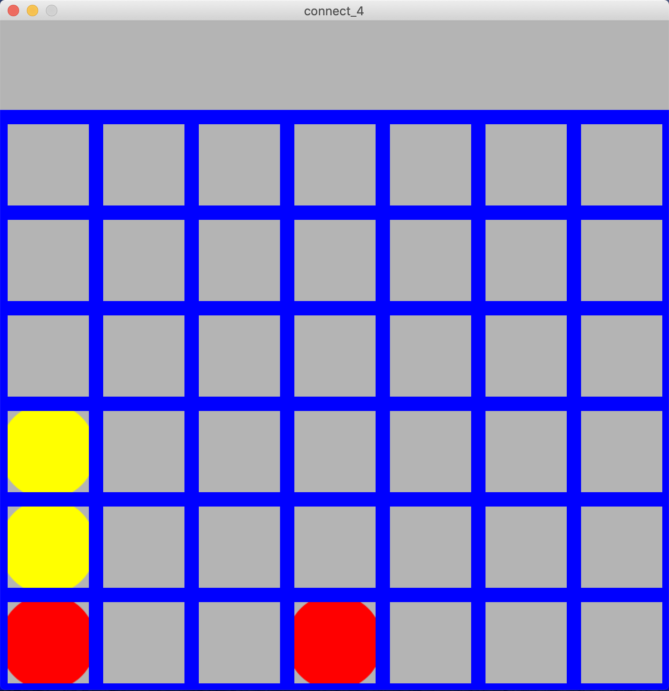
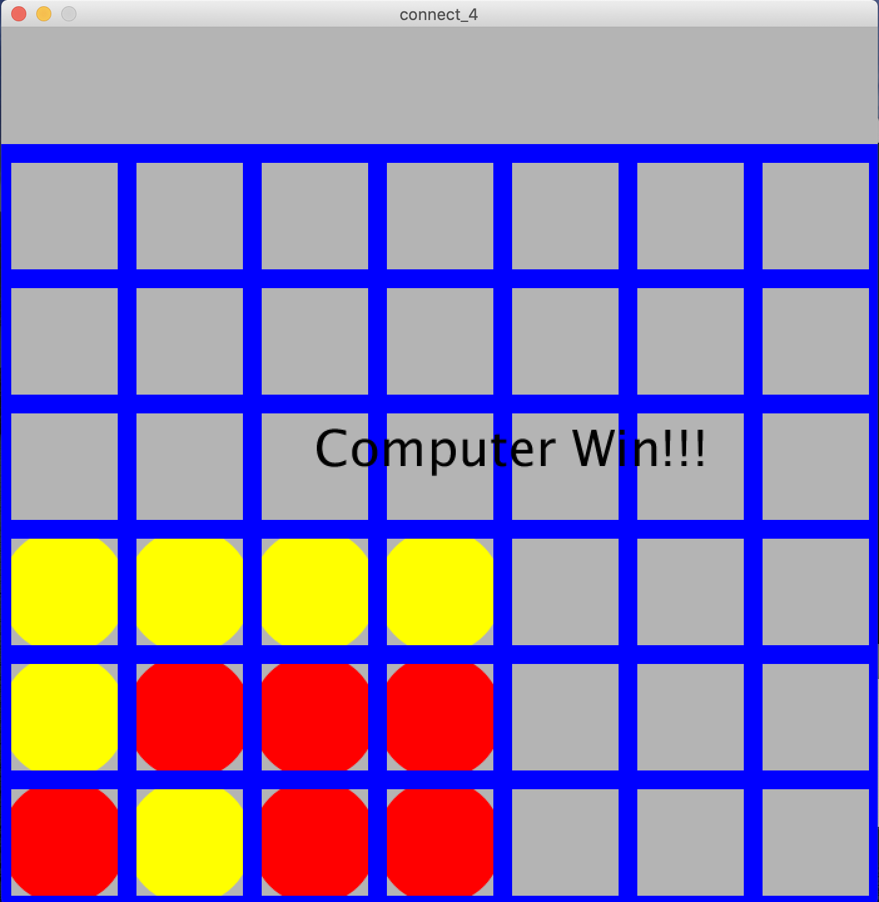

# connect-four
Strategy

1. Created a strategy connect four game with an AI controller using Python
2. Applied a greedy algorithm to let AI make smart moves to beat the human player
3. Established the user interface with Processing within the context of the visual arts
4. Devised the result demonstration with recording player's name and writing scores to local file

Connect-four is a two-player connection board game, in which the players choose a color and then take turns dropping colored discs into a seven-column, six-row vertically suspended grid. The pieces fall straight down, occupying the lowest available space within the column

Who first connects four discs win!!!

